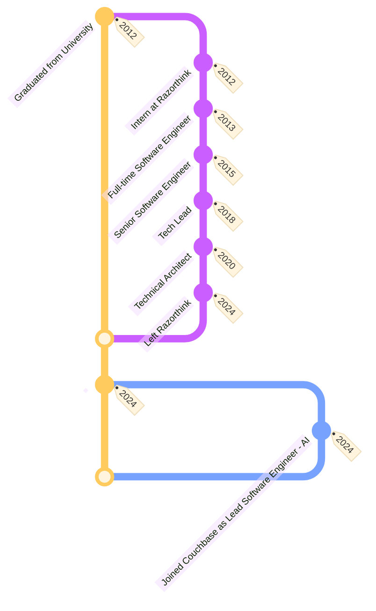

import RazorthinkLogo from '@site/static/img/razorthink-logo.jpeg';

# About

Hey 👋! I'm a software engineer who's been building cool [software products](/docs/category/projects) for over a decade.
I love creating impactful software products and solutions.
I have extensive experience mentoring newer developers and leading teams to create innovative solutions.
Tech is my jam - I'm always tinkering with new tools and sharing what I build through [open-source projects](/docs/category/open-source-projects). 
Beyond coding, I'm passionate about photography and love capturing beautiful moments. Check out some of my work in my [photography portfolio](/docs/beyond-tech/photography).

<!-- ```mermaid
gantt
    title My Career Journey
    dateFormat YYYY-MM-DD

    section Early Career (2012-2015)
    Graduated from University         :done, 2012-06-01, 30d
    Intern at Razorthink              :a1, 2012-07-01, 6M
    Full-time Software Engineer       :a2, after a1, 2y
    Senior Software Engineer          :a3, after a2, 3y

    section Growth Years (2016-2020)
    Tech Lead                         :b1, 2018-01-01, 2y
    Technical Architect               :b2, after b1, 4y

    section Current (2021-Present)
    Left Razorthink                   :c1, 2024-03-01, 1d
    Lead Software Engineer - AI (Couchbase) :c2, after c1, 1y
``` -->

### Professional Journey



### Work Experience

#### At [Razorthink](https://www.linkedin.com/company/razorthink/)


- Led the development of B2B platforms, including Razorthink aiOS (a platform for building and running custom AI
  solutions) and Foresight AI (an AI-based demand forecasting platform catering to FMCG companies).
- Collaborated with a major Indian bank to develop and implement AI solutions on the Razorthink aiOS platform, targeting
  customer churn and enhancing cross-selling and upselling strategies.
- Partnered with a leading telecom company in India to develop and implement AI solutions on the Razorthink aiOS
  platform, focusing on reducing customer churn and recommending recharge plans based on user data usage.
- Architected systems using microservices with Spring Boot, Spring Cloud Gateway, Kong API Gateway, Spring web security,
  Eureka service registry, Spring admin. Orchestrated OAuth flow implementation using Keycloak.
- Setup the observability stack with Loki, Tempo, Prometheus, and Grafana. Setup dashboards to monitor HTTP request
  latency and throughput, traces and issues across the system and a central log view.
- Developed custom distributed data processing systems using message broker for diverse functions such as ingesting data
  from multiple sources, extracting, processing and applying transformations and writing the data to data sinks.
- Designed and implemented a custom workflow orchestration system to efficiently manage dynamically specified workflows
  and execute associated tasks.
- Led UX and UI teams in designing and building elegant and functional user interfaces with Javascript, Bootstrap,
  Jquery and React.
- Collaborated with cross-functional teams, including business leaders, product managers, designers, AI teams,
  and other stakeholders, ensuring alignment with the product roadmap. Worked alongside customer teams to seamlessly
  integrate their systems with the product.
- Led research and development initiatives to evaluate tools and technologies. Presented product releases to
  stakeholders, mentored junior engineers, and maintained comprehensive technical documentation for the products.

### Skills

Java, Spring, Python, Kafka, Apache Spark, Elasticsearch, PostgreSQL, MongoDB, Cassandra, Redis, AWS, Azure, Docker, Terraform, Keycloak, Kong, Nginx, Grafana, Graylog, Jenkins, TeamCity, Apache ActiveMQ, Netflix Conductor, Celery, Hadoop, JUnit, Selenium, Apache JMeter.

<!-- ### Skills

| Skill Category                        | Technologies                                                        |
|---------------------------------------|---------------------------------------------------------------------|
| **Programming Languages**             | Java, Python                                                        |
| **Web Development**                   | Spring, FastAPI                                                     |
| **Databases**                         | Postgres, MongoDB, Cassandra                                        |
| **Messaging / Queuing**               | Apache ActiveMQ, Kafka                                              |
| **Searching, Indexing, Lookups**      | Elasticsearch, Redis                                                |
| **Distributed Processing**            | Apache Spark, Hadoop, Celery, Netflix's Conductor                   |
| **Containerization / Virtualization** | Docker                                                              |
| **Cloud Infrastructure**              | AWS, Azure                                                          |
| **Miscellaneous Tools / Services**    | Terraform, Keycloak, Kong, Nginx, Graylog, Grafana, Jenkins (CI/CD) |
| **Testing Tools and Frameworks**      | JUnit, Selenium, Apache JMeter                                      |
| **UI/UX (Level: Basic)**              | HTML, CSS, JavaScript, Bootstrap, jQuery, Ajax, Socket.io           | -->
